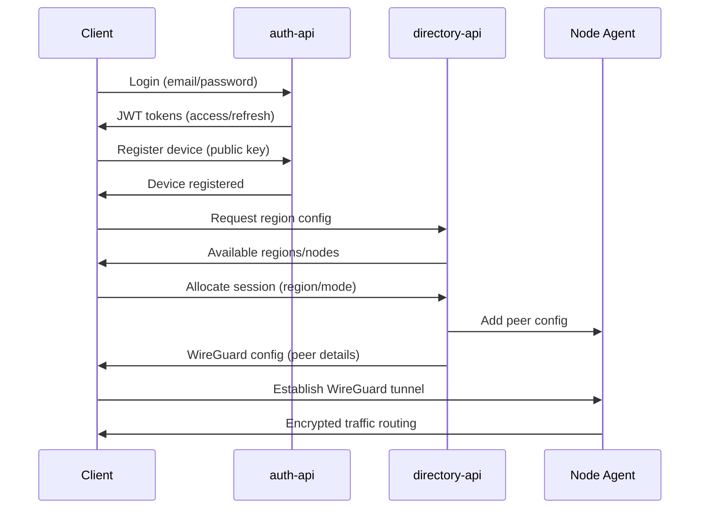
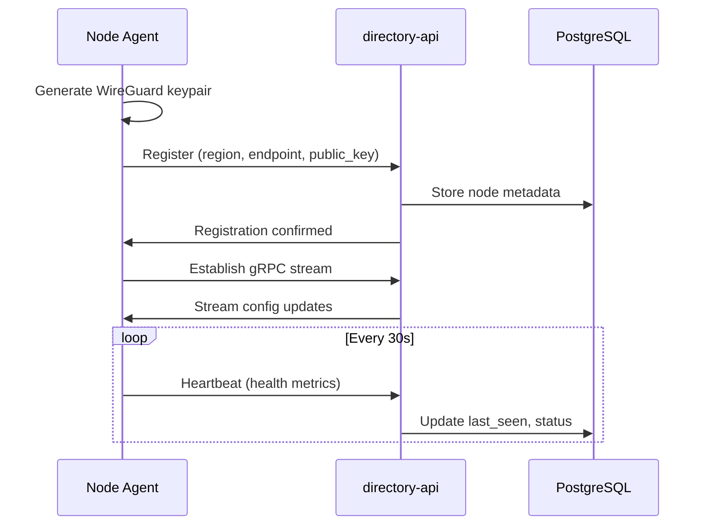

# System Architecture

This document describes the high-level architecture of the privacy-focused VPN stack, detailing how clients, control-plane services, node agents, and observability components interact to provide secure, performant VPN connectivity.

---

## Architecture Overview

The VPN system follows a three-tier architecture:

1. **Client Tier**: Desktop applications (Windows, macOS, Linux) with Rust networking core
2. **Control Plane**: FastAPI services managing authentication, directory, and administration
3. **Data Plane**: Rust-based WireGuard node agents providing encrypted tunnels

```
┌─────────────────┐    ┌─────────────────┐    ┌─────────────────┐
│   Desktop       │    │   Control       │    │   Node          │
│   Clients       │◄──►│   Plane         │◄──►│   Agents        │
│                 │    │                 │    │                 │
│ • Tauri UI      │    │ • auth-api      │    │ • WireGuard     │
│ • Rust Core     │    │ • directory-api │    │ • RAM-only      │
│ • Kill Switch   │    │ • admin-api     │    │ • Ephemeral     │
└─────────────────┘    └─────────────────┘    └─────────────────┘
```

---

## Component Details

### Desktop Clients

**Technology Stack:**
- **Core**: Rust with `wireguard-rs` for high-performance packet handling
- **UI**: Tauri framework providing native desktop experience
- **Platform Integration**: OS-specific TUN interfaces, DNS management, firewall rules

**Key Features:**
- Local-first operation with kill switch enforcement
- DNS leak protection and split tunneling
- Automatic updates with signature verification
- Cross-platform installers (MSI, PKG, DEB/RPM)

**Architecture:**
```
┌─────────────────────────────────────┐
│           Tauri Frontend            │
│  (HTML/CSS/JS + Rust Backend)       │
├─────────────────────────────────────┤
│         VPN Core (Rust)             │
│ • Connection Management             │
│ • Profile Storage                   │
│ • Token Management                  │
├─────────────────────────────────────┤
│      Platform Layer (Rust)          │
│ • TUN Interface                     │
│ • DNS Configuration                 │
│ • Firewall Rules                    │
│ • Kill Switch                       │
└─────────────────────────────────────┘
```

### Control Plane Services

The control plane consists of three FastAPI microservices:

#### auth-api (Port 8080)
**Purpose**: User authentication and device management

**Key Endpoints:**
- `/users/register` - User registration with GDPR consent
- `/auth/login` - JWT token issuance (access + refresh)
- `/auth/refresh` - Token rotation
- `/devices/register` - Device public key registration
- `/auth/device/*` - PKCE device flow for headless clients
- `/.well-known/jwks.json` - JWT verification keys

**Security Features:**
- Argon2id password hashing
- RS256 JWT with rotating keys (24h rotation)
- Short-lived access tokens (15min)
- Refresh token JTI tracking in Redis
- Optional TOTP 2FA

#### directory-api (Port 8081)
**Purpose**: Node registry, region management, and client configuration

**Key Endpoints:**
- `/regions` - Region CRUD operations
- `/nodes/register` - Node agent registration
- `/nodes/heartbeat` - Node health reporting
- `/mesh/client-config` - Client session allocation
- `/mesh/sessions/{id}` - Session termination

**gRPC Interface:**
- Long-lived config streaming to node agents
- Real-time peer updates and routing changes

#### admin-api (Port 8082)
**Purpose**: Fleet management and operational controls

**Features:**
- User management and device oversight
- Node fleet monitoring and control
- Audit logging and compliance reporting
- System health dashboards

### Node Agents

**Technology**: Rust with `wireguard-rs` userspace implementation

**Key Characteristics:**
- **RAM-only operation**: No persistent state on disk
- **Ephemeral keys**: WireGuard keys rotate on restart/daily
- **Minimal privileges**: Containerized with restricted capabilities
- **Self-registering**: Bootstrap against directory-api on startup

**Deployment Modes:**
1. **Single-hop gateways**: Direct client-to-internet routing
2. **Multi-hop mesh**: Chained routing through multiple nodes
3. **Exit nodes**: Dedicated egress points with specific IP ranges

**Runtime Flow:**
```
1. Generate ephemeral WireGuard keypair
2. Register with directory-api (region, endpoint, public key)
3. Establish gRPC config stream
4. Accept peer configurations from control plane
5. Route client traffic through WireGuard interface
6. Send periodic heartbeats with health metrics
```

---

## Data Flow

### Client Connection Flow



### Node Registration Flow



---

## Security Architecture

### Trust Boundaries

1. **Client ↔ Control Plane**: HTTPS with JWT bearer tokens
2. **Control Plane ↔ Nodes**: mTLS with certificate-based authentication
3. **Client ↔ Nodes**: WireGuard with ephemeral key exchange
4. **Internal Services**: Service mesh with mutual TLS (future)

### Key Management

**JWT Signing Keys (auth-api)**:
- RS256 algorithm with 2048-bit keys
- 24-hour rotation cycle
- JWKS endpoint for public key distribution
- Private keys stored in memory only

**WireGuard Keys (nodes)**:
- Curve25519 ephemeral keypairs
- Generated on node startup
- Rotated daily or on restart
- Never persisted to disk

**mTLS Certificates**:
- PKI hierarchy: Root CA (offline) → Intermediate CA (90d) → Leaf certs (30d)
- Automated rotation via `tools/pki/` scripts
- Certificate transparency logging (future)

### Privacy Protections

**No Traffic Logging**:
- Access logs disabled at ingress layer
- Application logs exclude request bodies and PII
- Node agents operate in RAM-only mode
- DNS queries not logged or stored

**Data Minimization**:
- User data limited to email, password hash, consent flags
- Device data limited to public keys and platform info
- Session data limited to JTI references and expiry times
- Aggregate metrics only for observability

---

## Observability Architecture

### Metrics Collection

**Prometheus Metrics**:
- Service health and performance (latency, throughput, errors)
- Node agent health (CPU, memory, active connections)
- Aggregate connection statistics (no per-user data)

**OpenTelemetry Tracing**:
- Request flow tracing across services
- Performance bottleneck identification
- Error correlation and debugging

### Monitoring Stack

```
┌─────────────────┐    ┌─────────────────┐    ┌─────────────────┐
│   Services      │───►│   Prometheus    │───►│    Grafana      │
│   (metrics)     │    │   (collection)  │    │  (dashboards)   │
└─────────────────┘    └─────────────────┘    └─────────────────┘
                                │
                                ▼
                       ┌─────────────────┐
                       │  Alertmanager   │
                       │   (alerting)    │
                       └─────────────────┘
```

### Service Level Objectives (SLOs)

- **API Availability**: 99.9% uptime for auth and directory services
- **API Latency**: 95th percentile < 200ms for authentication flows
- **Node Health**: 99% of nodes reporting healthy status
- **Connection Success**: 99% successful tunnel establishment rate

---

## Deployment Architecture

### Development Environment

Single-host deployment using Docker Compose:

```yaml
services:
  postgres:     # Shared database
  redis:        # Session store and caching
  auth-api:     # Authentication service
  directory-api: # Directory and node management
  admin-api:    # Administrative interface
  node-agent:   # Development node instance
  prometheus:   # Metrics collection
  grafana:      # Monitoring dashboards
```

### Production Environment

Multi-host deployment with service separation:

**Control Plane Cluster**:
- Load-balanced FastAPI services
- Managed PostgreSQL (primary/replica)
- Redis cluster for session storage
- Prometheus/Grafana for monitoring

**Node Fleet**:
- Geographically distributed node agents
- Container orchestration (Docker/K8s)
- Automated health checks and replacement
- Regional egress IP management

**Edge Infrastructure**:
- CDN for client downloads and updates
- WAF and DDoS protection
- Rate limiting and abuse prevention

---

## Scalability Considerations

### Horizontal Scaling

**Control Plane**:
- Stateless FastAPI services scale horizontally
- Database read replicas for query distribution
- Redis clustering for session storage
- Load balancing with health checks

**Node Fleet**:
- Regional node clusters for latency optimization
- Automatic scaling based on connection demand
- Geographic distribution for compliance requirements

### Performance Optimizations

**Client Performance**:
- Rust networking core for minimal latency
- Multi-queue TUN interfaces where supported
- Connection pooling and keep-alive optimization

**Service Performance**:
- Async/await patterns in FastAPI services
- Connection pooling for database access
- Redis caching for frequently accessed data

---

## Compliance and Governance

### Data Residency

**Regional Enforcement**:
- User residency flags control data processing location
- EU users' data processed only in EU regions
- Configurable region selection per compliance requirements

### Audit and Compliance

**GDPR Compliance**:
- Data export via `/gdpr/export` endpoints
- Data deletion via `/gdpr/delete` endpoints
- Consent management and tracking
- DPA and ROPA documentation maintained

**Security Auditing**:
- Structured audit logs (no PII)
- Certificate transparency logging
- Penetration testing coordination
- Supply chain security (SBOMs, signed releases)

---

## Future Architecture Evolution

### Phase 1: Multi-hop Mesh
- Client-configurable routing through multiple nodes
- Dynamic path selection based on latency/load
- Onion-style encryption for enhanced privacy

### Phase 2: Advanced Features
- Split tunneling with application-level controls
- WireGuard kernel module integration option
- Mobile client support (separate repository)

### Phase 3: Enterprise Features
- SAML/OIDC integration for enterprise auth
- Centralized policy management
- Advanced analytics and reporting
